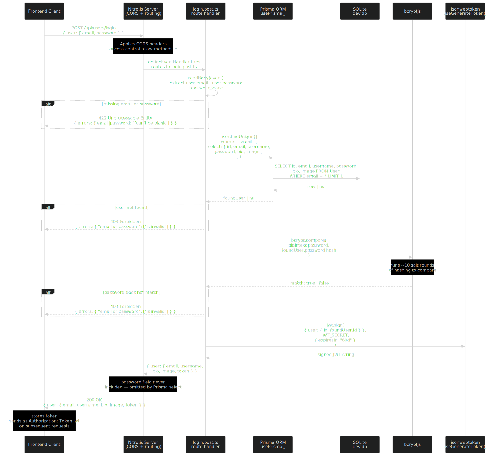

# Architecture Overview

**Date:** 2026-02-26

## Project Overview

This repository is the [RealWorld / Conduit](https://github.com/gothinkster/realworld) reference implementation — a monorepo that provides a canonical backend API, a documentation site, a shared API specification, and an end-to-end test suite. The backend is a Nitro.js REST API backed by Prisma ORM and SQLite, implementing the full Conduit specification (users, articles, comments, tags, follows, favorites). The documentation site is a static Astro 5 + Starlight site explaining how to build new frontend or backend implementations against the same spec. Any compliant frontend (the Angular demo lives at `demo.realworld.show`) can connect to the hosted API at `api.realworld.show`, and any new implementation can be validated against the shared Playwright E2E suite and Hurl/Bruno/Postman API collections in `specs/`.

---

## Frontend Architecture

The frontend in this repository is the documentation site (`apps/documentation`), built with Astro 5 and the Starlight documentation framework. It is a fully static site with 23 routes generated from Markdown/MDX content files, styled with Tailwind CSS v4 using a custom purple/violet theme bridged into Starlight's CSS variables. There is no client-side state management or API integration — React 19 is installed but reserved for future interactive islands.

---

## Backend Architecture

The backend (`apps/api`) is a Nitro.js server using file-system routing, where each file under `server/routes/` maps directly to an HTTP method and endpoint. Authentication is handled by a `definePrivateEventHandler` higher-order function that verifies JWTs from the `Authorization` header and injects the caller's user ID into route context. Business logic lives directly in route handlers with shared utilities for password hashing, token generation, and response mapping. Prisma 6 provides the ORM layer over a local SQLite database.

---

## Data Flow

The sequence below traces a user login request from the frontend client through the Nitro.js routing layer, Prisma ORM, SQLite database, bcrypt password verification, and JWT generation, back to the client. Error paths (missing fields, unknown user, wrong password) are shown inline. Note that the password hash is selected from the database solely for the bcrypt comparison and is never included in the response.

---

## Dependencies & Integrations

This project has a deliberately small external surface area. There are no third-party API calls, no Redis or cache layer, no message queues, no CDN, and no external auth provider. The only data store is an embedded SQLite file. The only secret is a single `JWT_SECRET` environment variable. The most active external integrations are on the CI/CD side: GitHub Actions handles docs deployment to GitHub Pages, Bruno collection validation on every push, and CodeQL security scanning. Dependabot raises weekly PRs for npm and Actions updates.

---

## Component Summary

| Component | Type | Path |
|---|---|---|
| Nitro.js API server | Backend entry point | `apps/api/nitro.config.ts` |
| Auth HOF middleware | Middleware | `apps/api/server/auth-event-handler.ts` |
| Auth routes | Route handlers | `apps/api/server/routes/api/users/` |
| User routes | Route handlers | `apps/api/server/routes/api/user/` |
| Profile routes | Route handlers | `apps/api/server/routes/api/profiles/` |
| Article routes | Route handlers | `apps/api/server/routes/api/articles/` |
| Comment routes | Route handlers | `apps/api/server/routes/api/articles/[slug]/comments/` |
| Tag routes | Route handlers | `apps/api/server/routes/api/tags/` |
| v2 Auth routes (experimental) | Route handlers | `apps/api/server/routes/api/v2/auth/` |
| Password hashing | Utility | `apps/api/server/utils/hash-password.ts` |
| JWT generation | Utility | `apps/api/server/utils/generate-token.ts` |
| Prisma singleton | Utility | `apps/api/server/utils/prisma.ts` |
| Article response mapper | Utility | `apps/api/server/utils/article.mapper.ts` |
| Author/Profile response mapper | Utility | `apps/api/server/utils/author.mapper.ts`, `profile.utils.ts` |
| Prisma schema | Database models | `apps/api/prisma/schema.prisma` |
| SQLite database | Database | `apps/api/prisma/dev.db` |
| Database seed | Seed script | `apps/api/prisma/seed.ts` |
| Astro docs site | Frontend entry point | `apps/documentation/astro.config.mjs` |
| Tailwind theme | Styling | `apps/documentation/src/tailwind.css` |
| Documentation content | Content | `apps/documentation/src/content/docs/` |
| OpenAPI specification | API spec | `specs/api/` |
| Playwright E2E tests | Test suite | `specs/e2e/` |
| Docs deploy workflow | CI/CD | `.github/workflows/deploy-docs.yml` |
| Bruno check workflow | CI/CD | `.github/workflows/bruno-check.yml` |
| CodeQL analysis | CI/CD | `.github/workflows/codeql.yml` |
| Dependabot config | CI/CD | `.github/dependabot.yml` |
